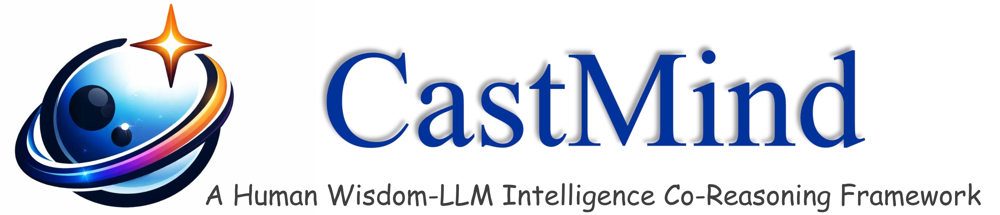
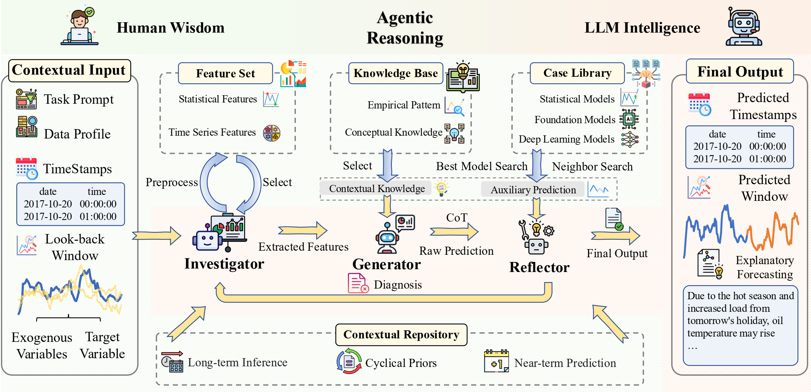
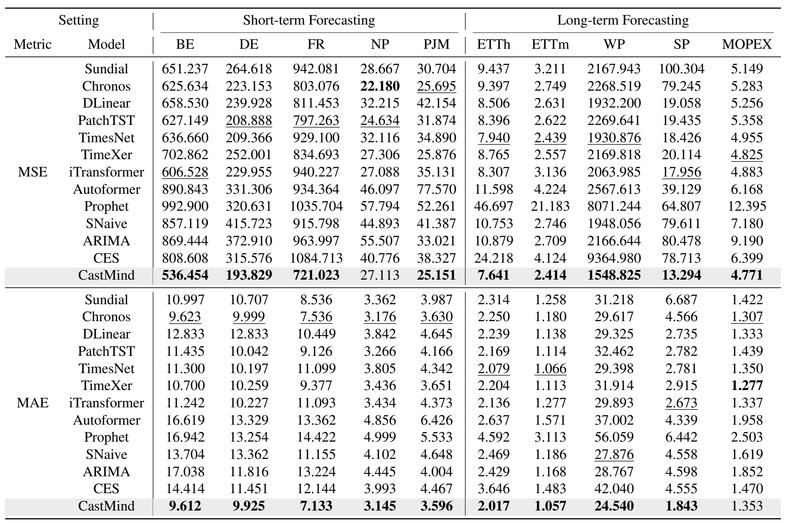

<h1 align="center"> 🌟 AlphaCast: A Human Wisdom-LLM Intelligence Co-Reasoning Framework 

for Interactive Time Series Forecasting. </h1>

<p align="center"></p>


## 📢 News

<details open>
<summary><b>Recent Updates</b></summary>

- [2025.11.26]**The Alphacast code has been open-sourced**
- [2025.11.12] **Alphacast initialized**：arxiv：[AlphaCast: A Human Wisdom-LLM Intelligence Co-Reasoning Framework for Interactive Time Series Forecasting](https://arxiv.org/abs/2511.08947)

</details>

## 🧠 Overview

AlphaCast is a **human wisdom–LLM intelligence co-reasoning** framework for time series forecasting, redefining the task from a traditional one-shot prediction pipeline into an interactive multi-stage cognitive process. Unlike static forecasting models, AlphaCast enables step-by-step collaboration between human expertise and LLM intelligence to jointly accomplish **contextual grounding, generative forecasting, evaluation, and reflective refinement**.The framework systematically integrates statistical and temporal features, domain knowledge, contextual information, and case-based reasoning to construct a unified forecasting workflow. Through its generative reasoning module and reflective optimization mechanism, AlphaCast delivers strong performance on both short-term and long-term forecasting tasks, demonstrating robust adaptability to complex, real-world dynamic environments.

<p align="center"></p>

## 🔥 Key Features

- **Human Wisdom–LLM Intelligence Co-Reasoning Mechanism**: Employs a two-stage collaborative workflow that enables LLM intelligence and human expertise to jointly accomplish evidence integration, forecast generation, and decision refinement.

- **Rich Contextual Awareness**: Integrates task instructions, dataset descriptions, timestamps, exogenous variables, and historical sequences to construct a comprehensive cognitive foundation for forecasting.

- **Feature Library and Knowledge Base Support**: Automatically extracts more than 20 statistical and temporal features and incorporates both conceptual and empirical domain knowledge to enhance interpretability and predictive performance.

- **Case Library–Driven Instance-Based Reasoning**: Retrieves similar historical segments through clustering and model evaluation, providing auxiliary guidance for forecasting and strategy selection.

## 🚀 Easy Experiments


To quickly reproduce our experiments, follow these simple steps:

1. **Prepare environment & data**
   - Set up all checkpoints for deep learning models and foundation models.
   - Set up your data folder.

2. **Create and activate conda environment**

```bash
conda create -n alphacast python=3.9 -y
conda activate alphacast
```

3. **Install dependencies**

```bash
pip install -r requirements.txt
```

4. **Run experiments**

```bash
python run_experiment.py
```

## 🧪 Experimental Results

AlphaCast consistently achieves the best performance across most datasets, demonstrating a significant advantage over statistical baselines, recent deep learning models, and foundation models. The following figure presents its experimental results in both short-term and long-term forecasting.
<p align="center"></p>

## 🤝 Contributors

**Student Contributors**: [**Xiaohan Zhang**](https://github.com/echo01-ai), [**Tian Gao**](https://github.com/SkyeGT), [**Bokai Pan**](https://github.com/Forever-Pan), [**Ze Guo**](https://github.com/Kawai1Angel), [**Yaguo Liu**](https://github.com/liuyaguo), [**Xiaoyu Tao**](https://github.com/Xiaoyu-Tao), [**Jiahao Wang**](https://github.com/realwangjiahao)

**Supervisors**: [**Mingyue Cheng**](https://mingyue-cheng.github.io/)

**Affiliation**: **State Key Laboratory of Cognitive Intelligence, University of Science and Technology of China**

## 🥰 Acknowledgements

We would like to express our sincere appreciation to the creators of [Pydantic AI](https://ai.pydantic.dev/)  and [thuml/Time-Series-Library](https://github.com/thuml/Time-Series-Library) for providing such a robust framework, which has been integral to the success of our project.Additionally, we are deeply thankful for the insightful feedback and contributions from the collaborators of this work, including Xiaohan Zhang, Tian Gao, Bokai Pan, Ze Guo, Yaguo Liu, Xiaoyu Tao, and Jiahao Wang. It is their dedicated efforts and invaluable contributions that have made this work possible.

## ✍️ Citation

AlphaCast

```md
@article{zhang2025alphacast,
  title={AlphaCast: A Human Wisdom-LLM Intelligence Co-Reasoning Framework for Interactive Time Series Forecasting},
  author={Zhang, Xiaohan and Gao, Tian and Cheng, Mingyue and Pan, Bokai and Guo, Ze and Liu, Yaguo and Tao, Xiaoyu},
  journal={arXiv preprint arXiv:2511.08947},
  year={2025}
}
```
